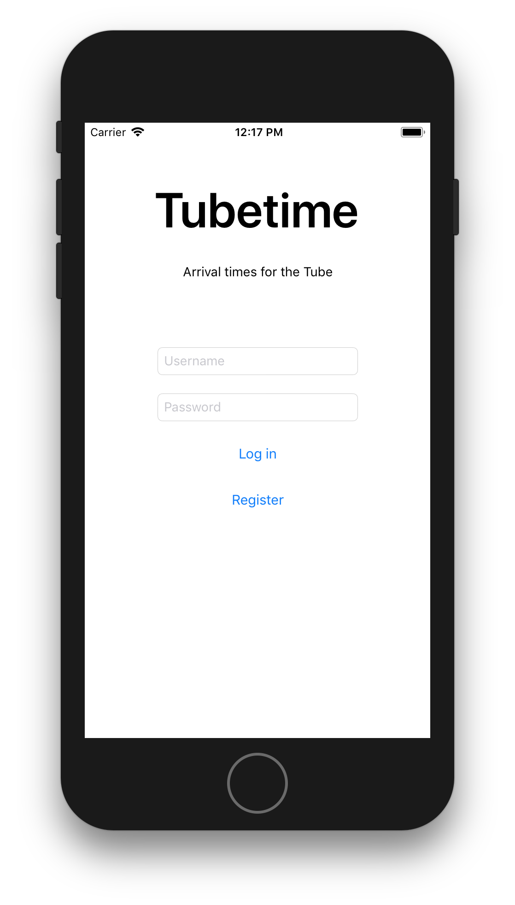
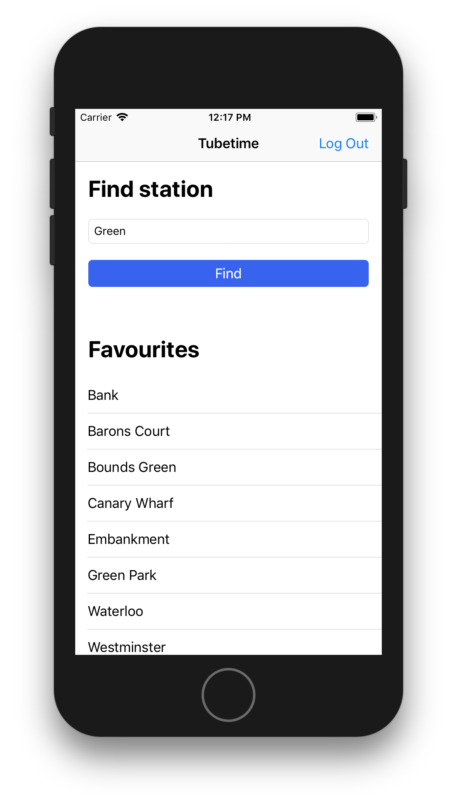
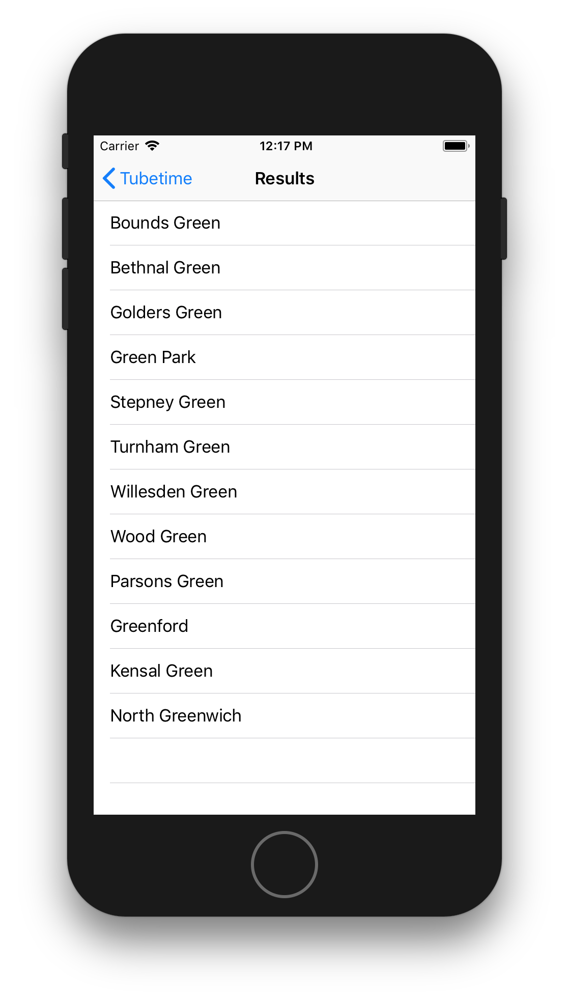
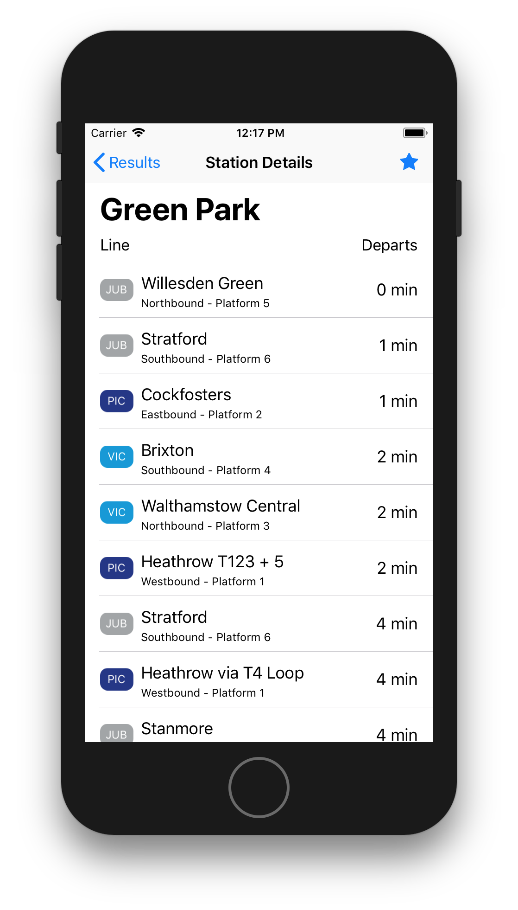

# Tubetime

======
Tubetime is an app that lets you find tube station in London, view the arrival times of trains that come through these stations, and favourite your regular stations for quick access.

#### Screenshots

## Works on

Devices running IOS 11 or higher.

## Credits
### Artwork
* Any credit to artists(music,images,...)

### Firebase code
* https://www.raywenderlich.com/139322/firebase-tutorial-getting-started-2

## Version 
* Version 1.0

## How-to use
To use the app, create an account. When you have logged in, you will be able to search for stations and add these stations to your favourites. Favourite station are synced accross devises. Pull the table in the detail screen down reload arrival data.

## Contact

Sam Kortekaas - 10718095
Mail: samkortekaas1@gmail.com

